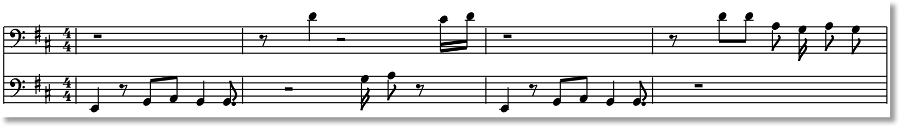

# BassGenerator
## Funk Bass with Recurrent Neural Nets

This code is part of a project to train a generative model to create original funk bass. The training data consisted of 208 funk bass lines in 4 measure segments, 4/4 time signature, and in a midi format.

### Midi Tools

In order to breakdown and recreate midi files, I used a python package made available on github: https://github.com/vishnubob/python-midi

I played the midi tracks in Ableton music production software, but you can also play the midi tracks with python with pygame: http://www.pygame.org/docs/ref/midi.html

### Preparing the data
Below is a 4 bar segment of the bass line from Fantastic Voyage by Lakeside.

After parsing this midi file with the python midi package mentioned above, you have an output similar to this:

A midi file is comprised of a sequence of music events. The most common are NoteOnEvents and NoteOffEvents. The "tick" refers to when an event occurred relative to the previous event. The "channel" refers the instrument. The first item in the "data" list denotes the pitch of that event (whether that pitch is beginning or ending depends on whether it's a NoteOnEvent or NoteOffEvent). The second item in the "data" list is the velocity in which a note was played.

To get the data into a format your model can begin to train on will require the musical data in this midi bass line to be in a matrix.

If we consider 16th notes as the maximum resolution in regards to quantization, then we can separate the bass line from above into 64 time steps where a note can potentially be initiated.

Each marked note indicates an a not beginning. The pitch, length of the note, and velocity will be contained within a list at each time step.

With numerical values, it would appear as:

The values should then be normalized from -1 to 1 for best results in training:

Negative 1 represents no note being initated at that time step.

### Training

Now that we have our bass lines into the correct format, we beginning dividing up our training inputs and outputs. Below, I have the 64 time steps of a bass line, each with unique pitch, note length, velocity combination. I have chosen to use 32 time steps (16th notes) as my input sequence and the 33rd time step as the training output.

I parse through the entire bass line one step at a time, generating input output pairs. This is repeated for all bass lines in my training set.

Below is an oversimplified diagram of a recurrent neural network.

My input X's being my 32 time step input sequences, and my Xt+2 being the next time step after each input sequence. The network will seek to learn the quantitative relationship between inputs sequences and their corresponding outputs.

The current architecture I'm using for my model:
* 1 LSTM hidden layer
* 128 neurons
* RMSprop optimization
* 500 epochs

